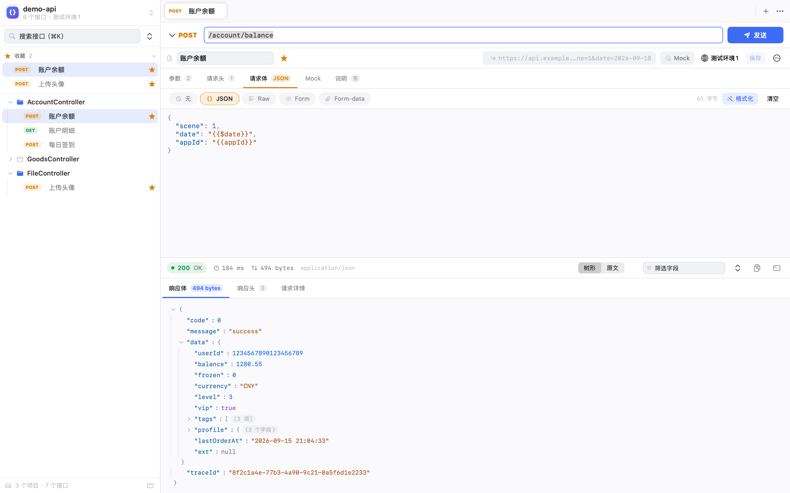
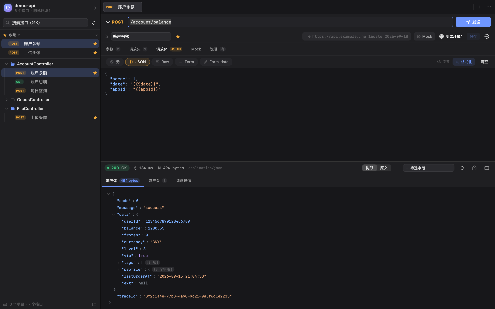

# API Client（macOS 原生版）

接口管理与调试工具，macOS 原生应用。**多项目隔离 · 跨项目多标签 · 多环境变量 · 保序 JSON 响应查看**。

纯 Swift + SwiftUI 实现，单个 4.5 MB 二进制，不依赖 Electron / Node 运行时。

### 相比 Apifox / Postman 这类 Electron 客户端

- **省内存**：Electron 客户端启动即占数百 MB，多开几个标签更是水涨船高；本应用加载 9 个项目 / 2500+ 接口的工作区，常驻内存约 120 MB。
- **更流畅**：SwiftUI 原生列表与文本视图，没有 WebView 一层的渲染开销——侧边栏几千个接口秒开，切标签、切项目、切环境都是即时响应，长 JSON 响应保序高亮不卡顿。
- **启动即用**：4.5 MB 二进制冷启动不到一秒，没有登录墙、没有云同步弹窗、没有更新提示。
- **数据本地可读**：项目与请求都是 JSON 文件，拷目录即迁移，可以放进任意版本控制或同步盘。
- **零依赖可自检**：核心逻辑不依赖 SwiftUI，276 项自检只需 Command Line Tools 即可运行。



<details>
<summary>深色模式</summary>



</details>

```
Sources/ApiClientCore   ← 业务逻辑（模型 / 请求引擎 / 状态机），不依赖 SwiftUI，可无界面验证
Sources/APIClient       ← SwiftUI 界面 + 应用入口
```

架构与技术选型的完整说明见 [ARCHITECTURE.md](ARCHITECTURE.md)，视觉规范见 [DESIGN.md](DESIGN.md)。

---

## 快速开始

### 构建并运行

```bash
# 开发运行
swift run APIClient

# 打包成可双击的 .app（产物：dist/API Client.app）
./Scripts/build-app.sh
open "dist/API Client.app"
```

> 只需要 Xcode Command Line Tools，**不需要完整 Xcode**。`.app` 由 `Scripts/build-app.sh` 手工组装 Info.plist 与图标。

### 自检（276 项）

```bash
swift run APIClient --self-check
```

覆盖变量解析、请求编排、JSON 解析、Mock 生成、form-data 与文件上传（multipart 逐字节）、编辑器定位与 JSON 高亮、项目模型、持久化往返、收藏置顶、接口搜索评分、按项目隔离的两级标签语义、工作区导入。不依赖 XCTest——零依赖才能在只有 Command Line Tools 的环境里跑（本机即如此）。

### 导入参考项目的工作区

把已有的 `wac-workspace.json` 工作区一次性导入（多项目、自动按 Controller 分目录）：

```bash
swift run APIClient --import ../wac-workspace.json
# 导入 8 个项目，耗时 0.10s
# 导入后：9 个项目 / 2532 个接口

swift run APIClient --info        # 查看当前数据目录与各项目概况
```

也可以在界面里操作：侧边栏项目名 → 「导入项目 / 工作区…」。

### 重新生成图标

```bash
swift Scripts/make-icon.swift Resources
```

### 重新生成界面截图

```bash
swift run APIClient --snapshot docs
```

用屏幕外的真实窗口渲染，不需要屏幕录制权限，改完样式可以随时刷新 `docs/` 里的配图：

| 文件 | 内容 |
|---|---|
| `screenshot-light.png` / `screenshot-dark.png` | 整体界面（浅色 / 深色） |
| `screenshot-editor.png` | 请求编辑器 + 响应面板 |
| `screenshot-json-highlight.png` | JSON 高亮编辑器 + Mock 响应 |
| `screenshot-formdata.png` | 文件上传（含「文件已被移走」状态） |
| `screenshot-project-tabs.png` | 两级标签（项目标签 + 该项目自己的请求标签） |
| `screenshot-response-raw.png` | 响应原文（只读高亮、不折行） |
| `screenshot-mock.png` | Mock 分区 |
| `screenshot-project-menu.png` | 项目切换器（含各项目标签数） |
| `screenshot-empty.png` | 空工作区 |

---

## 功能

### 多项目

- 新建 / 重命名 / 复制 / 删除 / 导入 / 导出项目，项目之间接口、环境、变量**与标签页**完全隔离
- 侧边栏顶部切换器直接跳转，菜单里显示每个项目的接口数与**已打开的标签数**
- 首次启动自动创建一个带示例接口的项目（示例接口默认开着 Mock，点发送就有响应），不会面对空白界面

### 搜索

- 输入关键词即从「树」切换为**平铺结果列表**，按相关度排序，顶部显示命中数
- 匹配范围：**名称 / URL / 拼接 baseURL 后的完整地址 / 备注 / 方法**（`post`、`ge` 也能搜）
- **模糊匹配**：`accdet` 能命中 `/account/detail`（子序列匹配，连续命中与词首命中排更前）
- 从日志里**粘贴完整 URL** 也能找到对应接口；导入接口备注里的 Java 方法名同样可搜
- 结果行同时显示名称和 URL（命中靠完整 URL 时自动展示完整地址），收藏状态与右键菜单与树内一致
- **全键盘**：`⌘K` 聚焦搜索框，`↑` `↓` 在结果里移动、`↵` 打开、`Esc` 清空并退出，手不用离开键盘

### 收藏 / 置顶

- 常用接口一键加星：**树内行尾悬停**、**编辑器名称旁星标**、**右键菜单**（树行 / 标签页）四处都能收藏
- 收藏的接口置顶到侧边栏「**收藏**」区（集合树上方），点击即打开，树保持原样不展开、不跳转；区域可折叠，为空时不占位
- 置顶顺序 = 收藏顺序（新收藏追加到末尾，已有项位置不动），重启后保留
- 树内已收藏的行常驻金星指示；搜索结果里收藏状态同步显示
- 删除接口（或连同文件夹）自动取消收藏；另存为的新接口不继承收藏状态

### 标签页：两层结构

多项目同时打开时，标签分两层，**不合并也不覆盖**：

```
┌ 项目标签（顶层，只在同时打开多个项目时出现）─────────────────┐
│ ● demo-api (12) │ demo-ai-brain (1) │          2 个项目        │
├ 请求标签（当前项目自己的那一套）──────────────────────────────┤
│ POST 账户余额 × │ POST 商品搜索 × │ POST 上传头像 × │ + │ ⋯    │
└─────────────────────────────────────────────────────────┘
```

- **顶层**：每个「有标签的项目」一个 tab，同时可见；按项目列表顺序稳定排列（不按打开顺序，来回切位置不会跳）。tab 上显示项目名、标签数、有未保存时的圆点；悬停出现 × 关闭该项目全部标签；右键菜单同义。
- **下层**：只显示当前项目的请求标签——所以这里不会出现别的项目的标签，也不会有「关掉别的项目正在编辑的东西」这种事。
- **点项目 tab** = 切项目，同时恢复该项目**自己上次停留的那个标签**；其它项目的标签、编辑缓冲、响应、编辑器位置全都不动。
- **顶层只在「有标签的项目 ≥ 2」时出现**：只开了一个项目就退化为一层，不占没有信息量的那一行。
- 快捷键：`⌘⇧[` / `⌘⇧]` 在同项目标签间切换，`⌘⌥[` / `⌘⌥]` 在项目标签间切换。
- 关闭其他 / 关闭右侧 / 关闭全部只作用于当前项目；`⌘T` 新建草稿标签，`⌘W` 关闭。
- **关闭有未保存修改的标签会先问一句**（保存并关闭 / 不保存 / 取消），批量关闭时汇总成一次询问；没有脏标签时不打扰。
- 标签右键、编辑器「更多」菜单里有 **「在侧边栏中定位」**：需要时才把树展开并滚到该接口，平时点收藏、点树行都不会让树跳动。
- 每个标签独立持有编辑缓冲、响应、当前分区、编辑器光标与滚动位置，互不干扰。
- 打开标签时**按内容自动定位分区**：有请求体就停在请求体（JSON / Raw / Form / Form-data 就在那里），否则按参数 → Mock → 请求头找第一个有内容的；**「说明」不参与自动定位**（它是解释性文字，不是请求内容的位置）。
- 重启后按项目恢复各自打开的标签与活动标签，指向已删除接口的失效标签自动清理。

### 请求构造

- 方法、地址、Params（`query` / `path` 两种位置）、Headers、Body（无 / JSON / Raw / x-www-form-urlencoded / **form-data**）、Mock、说明
- 地址栏下方实时显示**变量替换与 baseURL 拼接后的真实地址**
- **JSON 语法高亮**：键 / 字符串 / 数字 / 字面量 / 标点分别着色，少一个引号一眼就能看出来；原文视图同样高亮，且不折行
- 请求体方式条会自动把当前方式滚进视野；**每种方式各自记住光标与滚动位置**，切来切去不用重新找位置；首次进入直接定位到正文起点（跳过前面几行空行）
- JSON 请求体带合法性校验与一键格式化（格式化后自动回到正文起点）
- 一键导出 cURL（含 shell 单引号转义；form-data 会导出成 `-F` 而不是 `--data-raw`）

### 文件上传（form-data）

- 请求体选 **Form-data**，每行可以选「文本」或「文件」；文件走系统文件选择器，不需要手写路径
- 值区域直接显示**文件名 + 大小**，点击即可换文件；底部统计「N 项生效 · N 个文件 · 合计 x MB」
- 文件状态一眼可辨：未选择 / 已选择（蓝） / **文件已被移走（红框 + 文件已不存在）**
- **发送前拦截**：文件没选或已不存在时不会静默漏发那一个文件，而是明确报错并**自动切到请求体分区**告诉你是哪个字段
- 编码按 RFC 规范生成：`Content-Type: multipart/form-data; boundary=…`，文字字段做变量替换，文件字段按扩展名推断 MIME（png/jpg/pdf/xlsx/docx/zip/mp4… 猜不到用 `application/octet-stream`）
- 单个文件上限 200 MB；导入的 form-data 接口不再降级，`type=file` 的字段直接标成文件字段等你选文件

### Mock

后端没就绪、服务起不来时，也能把前端链路先跑通。

- 每个接口一个 Mock 开关（请求栏上常驻 chip 一键切换），全局策略可选**关闭 / 按接口 / 全量**（设置里切）
- 响应体**默认按请求自动生成**，跟着请求方法与请求体方式走：

  | 请求体方式 | 自动生成的响应 |
  |---|---|
  | JSON | 把请求体字段原样镜像进 `data`（变量已替换成真实值，前端可直接照着渲染） |
  | Form | 表单字段整理成 JSON |
  | Raw | `text/plain` 回显请求体原文 |
  | 无（GET / DELETE 等） | 回显 query 与 path 参数 |

- 想固定返回值就在 Mock 分区手写覆盖（按请求体方式分开存），一样支持 `{{变量}}` 与 `{{$timestamp}}` 这类动态变量
- 可设状态码（含 4xx / 5xx，用来验证前端异常分支）、模拟延迟（验证 loading 与超时）、自定义响应头
- Mock 命中时**不发真实网络请求**，地址为空也能返回；响应面板会打 **MOCK** 徽标，不会和真实响应混淆

### 环境与变量

- 多环境，每个环境有 `baseURL` 与一组变量；项目级另有全局变量与全局请求头
- 相对路径自动拼当前环境 `baseURL`；也可直接写 `{{baseUrl}}`
- 请求头里写 `Authorization: Bearer {{token}}`，登录接口返回的 token 手动沉淀到环境变量即可复用
- 变量优先级：**运行时变量 > 环境变量 > 项目全局变量 > 内置动态变量**
- 内置动态变量：`{{$uuid}}` `{{$timestamp}}` `{{$timestampMs}}` `{{$date}}` `{{$time}}` `{{$datetime}}` `{{$isoDate}}` `{{$randomInt}}` `{{$randomStr}}` `{{$projectName}}` `{{$envName}}`
- **未定义的变量原样保留并高亮提示**，不会静默变成空字符串（那种失败最难排查）

### 响应查看

- 状态码 / 耗时 / 大小 / Content-Type / 重定向标记
- JSON **树形**查看：字段顺序与服务端一致，大整数（雪花 ID）不丢精度，可切换展开层级
- 树形视图可**按字段名 / 值筛选**：只显示命中的路径并自动展开，几千行的响应里找一个字段不用逐层点开
- 树的任意一行右键：**复制值 / 复制字段名 / 复制路径（`$.data.items[0].name`）/ 复制该节点 JSON**
- 原文视图、响应头列表（可选中复制）
- 请求详情页：实际发出的地址、最终请求头、请求体、cURL
- 编码兜底：UTF-8 → 响应头 charset → GB18030 → Latin-1
- **SSE 流式响应**：服务端回 `Content-Type: text/event-stream` 时自动进入流式模式，事件按到达顺序逐条展示（序号 / 事件名 / id / 相对时间 / data），接收中自动滚到最新一条；点「取消」停止并保留已收到的事件；「复制响应体」复制原始流文本

### 请求引擎

- `URLSession` 直连，无浏览器跨域限制，可访问本地服务与内网
- 支持随时取消在途请求
- 可关闭 TLS 证书校验（测试环境自签证书）
- 可关闭自动跟随重定向，便于检查跳转逻辑

---

## 快捷键

| 快捷键 | 功能 |
| --- | --- |
| `⌘ ↵` | 发送请求 |
| `⌘ .` | 取消发送 |
| `⌘ S` | 保存当前标签（草稿存为正式接口） |
| `⌘ T` | 新建请求标签 |
| `⌘ W` | 关闭当前标签（有未保存修改时会先问：保存并关闭 / 不保存 / 取消） |
| `⌘ K` | 聚焦侧边栏搜索框；结果列表里 `↑` `↓` 移动、`↵` 打开、`Esc` 清空 |
| `⌘ ⇧ ]` / `⌘ ⇧ [` | 下一个 / 上一个请求标签 |
| `⌘ ⌥ ]` / `⌘ ⌥ [` | 下一个 / 上一个项目标签 |
| `⌘ ⇧ N` | 新建项目 |

---

## 数据存储

```
~/Library/Application Support/APIClient/
├── workspace.json          活动项目 / 打开的标签 / 目录折叠状态 / 设置
└── projects/<uuid>.json    每个项目的全部内容
```

纯 JSON 文件，可直接查看、diff、纳入 git。侧边栏右下角按钮可在访达中打开该目录。

**注意**：环境变量以明文存储（含 token、密钥）。数据目录如需共享或同步，请自行评估。

---

## 目录结构

```
├── Package.swift
├── ARCHITECTURE.md                技术选型 / 分层架构 / 模块划分 / 设计取舍
├── DESIGN.md                      视觉与交互规范（颜色 / 间距 / 圆角 / 字体 / 动效 / 组件）
├── Sources/
│   ├── ApiClientCore/
│   │   ├── Models/                Project / APIRequest / APIEnvironment / MockConfig /
│   │   │                          CollectionNode / SessionPresentation（分区与编辑器位置）
│   │   ├── Services/              VariableResolver / RequestBuilder / MultipartBody / HTTPEngine /
│   │   │                          MockEngine / JSONValue / PersistenceStore /
│   │   │                          PersistenceWriter / WACImport
│   │   └── State/                 AppStore（+Tabs/+Import）/ TabSession
│   └── APIClient/
│       ├── main.swift             入口分流（界面 / 自检 / 导入 / 截图）
│       ├── APIClientApp.swift     App + 菜单命令 + 退出前落盘
│       ├── UIState.swift          界面态（弹窗、对话框）
│       ├── CLI.swift              --import / --info
│       ├── SelfCheck.swift        276 项自检
│       ├── SnapshotRenderer.swift --snapshot 界面截图
│       └── Views/
│           ├── Common/            Theme（设计令牌）/ Components / Illustrations /
│           │                      CodeEditor + CodeSyntax（语法高亮编辑器）
│           ├── Sidebar/           项目切换器 + 集合树 + 项目菜单
│           ├── Tabs/              项目标签条（顶层）+ 请求标签条（当前项目）
│           ├── Request/           请求编辑器 + 键值表格 + 请求体 + form-data + Mock
│           ├── Response/          响应面板 + JSON 树
│           └── Environment/       环境与变量
├── Resources/AppIcon.icns
├── docs/                          界面截图
└── Scripts/
    ├── build-app.sh               组装 .app
    └── make-icon.swift            生成图标
```

---

## 当前版本未包含

按优先级排列，详见 [ARCHITECTURE.md](ARCHITECTURE.md) 的路线图：

- 前置 / 后置脚本与断言（计划用系统自带的 JavaScriptCore）
- 请求历史记录
- 集合树拖拽排序
- WebDAV / 本地文件夹同步
- SSE 的 Mock（真实请求已支持流式）
- cURL 导入（导出已支持）

## 许可

本项目以 [MIT License](LICENSE) 开源。
